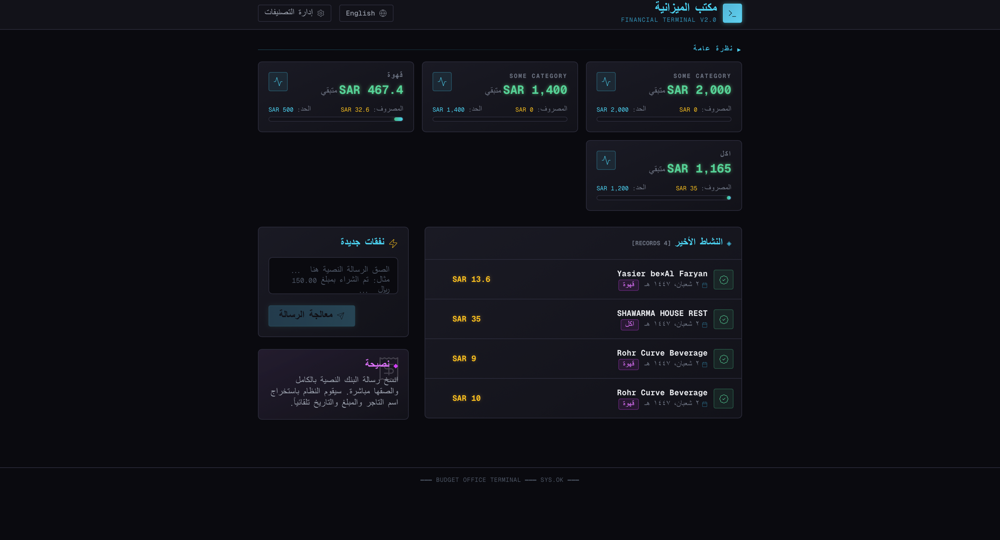

# Budget Office - Personal Finance Terminal

A retro-styled personal finance system built with **FastAPI** and **Next.js**, designed to automatically ingest, extract, and categorize expenses from SMS transaction notifications.




## 🚀 Features

* **SMS Parsing**: Automatically extracts *Amount* and *Merchant* from Arabic bank SMS messages from IOS shortcuts
* **Auto-Classification**: Rule-based system to categorize merchants (e.g., "Al Nahdi" → "Health")
* **Budget Limits**: Set spending limits per category and track remaining balance
* **Learning System**: Unknown merchants saved as "Unclassified" - add rules for future auto-categorization or immediate categorization
* **Bilingual UI**: Full English/Arabic support with RTL layout
* **Retro Terminal UI**: Dark 80's financial terminal aesthetic with neon accents

## 🛠️ Technology Stack

### Backend
* **Python 3.9+**
* **FastAPI** - REST API framework
* **SQLAlchemy** - Database ORM
* **SQLite** - Lightweight database storage
* **Pydantic** - Data validation

### Frontend
* **Next.js 16** - React framework
* **Tailwind CSS 4** - Styling
* **Lucide React** - Icons

## 🏃‍♂️ How to Run

### Backend
```bash
# Install dependencies
pip install fastapi uvicorn sqlalchemy pydantic

# Start the server
uvicorn main:app --reload
```

### Frontend
```bash
cd frontend/my-app

# Install dependencies
npm install

# Start development server
npm run dev
```

### Access
* **Frontend**: `http://localhost:3000`
* **API Docs (Swagger)**: `http://127.0.0.1:8000/docs`
* **API Docs (ReDoc)**: `http://127.0.0.1:8000/redoc`

---

## 📡 API Endpoints

### SMS Processing

#### `POST /sms/`
Ingest and process a bank SMS message. Extracts amount, merchant, and auto-classifies based on rules.

**Request:**
```json
{
  "message": "عملية شراء\nمبلغ: 50.00 SAR\nلدى: Al Nahdi"
}
```

**Response:**
```json
{
  "status": "SMS processed",
  "extraction_status": "success",
  "data": {
    "raw_invoice": "...",
    "amount": 50.0,
    "merchant": "Al Nahdi",
    "extraction_status": "success",
    "classification": "Expense",
    "main_category": "Health",
    "sub_category": "Pharmacy"
  }
}
```

---

### Invoices

#### `GET /invoices/`
Retrieve all invoices with optional pagination.

| Parameter | Type | Default | Description |
|-----------|------|---------|-------------|
| `skip` | int | 0 | Number of records to skip |
| `limit` | int | 100 | Max records to return |

#### `GET /invoices/{invoice_id}`
Get a specific invoice by ID.

#### `PATCH /invoice/{invoice_id}`
Update an invoice's classification.

**Request:**
```json
{
  "classification": "Expense",
  "main_category": "Food",
  "sub_category": "Restaurants"
}
```

---

### Category Rules

#### `POST /rules/`
Create a new classification rule.

**Request:**
```json
{
  "merchant_keywords": "Starbucks",
  "classification": "Expense",
  "main_category": "Food",
  "sub_category": "Coffee",
  "category_limit": 500.0
}
```

#### `GET /rules_list/`
Retrieve all classification rules.

#### `GET /rules/{rule_id}`
Get a specific rule by ID.

#### `PATCH /rule/{rule_id}`
Update an existing rule.

**Request:**
```json
{
  "merchant_keywords": "Starbucks",
  "classification": "Expense",
  "main_category": "Food",
  "sub_category": "Coffee",
  "category_limit": 600.0
}
```

#### `DELETE /rules/{rule_id}`
Delete a rule by ID.

---

### Categories & Budgets

#### `GET /categories/`
Get all distinct main categories from rules.

**Response:**
```json
["Food", "Health", "Transport", "Entertainment"]
```

#### `GET /category/limit/{category}`
Get the spending limit for a category.

**Response:**
```json
{
  "main_category": "Food",
  "category_limit": 2000.0
}
```

#### `GET /category/remaining_limit/{category}`
Get budget status including spent amount and remaining limit.

**Response:**
```json
{
  "main_category": "Food",
  "category_limit": 2000.0,
  "total_spent": 750.0,
  "remaining_limit": 1250.0
}
```

---


---

## 🎨 UI Theme
(built with claude opus 4.5)
The frontend features a **dark 80's financial terminal** aesthetic:
- Deep black backgrounds with neon cyan, magenta, and green accents
- Scanline overlay effect
- Glowing text and borders
- Monospace typography
- Grid background pattern

---

## 📝 License

MIT
