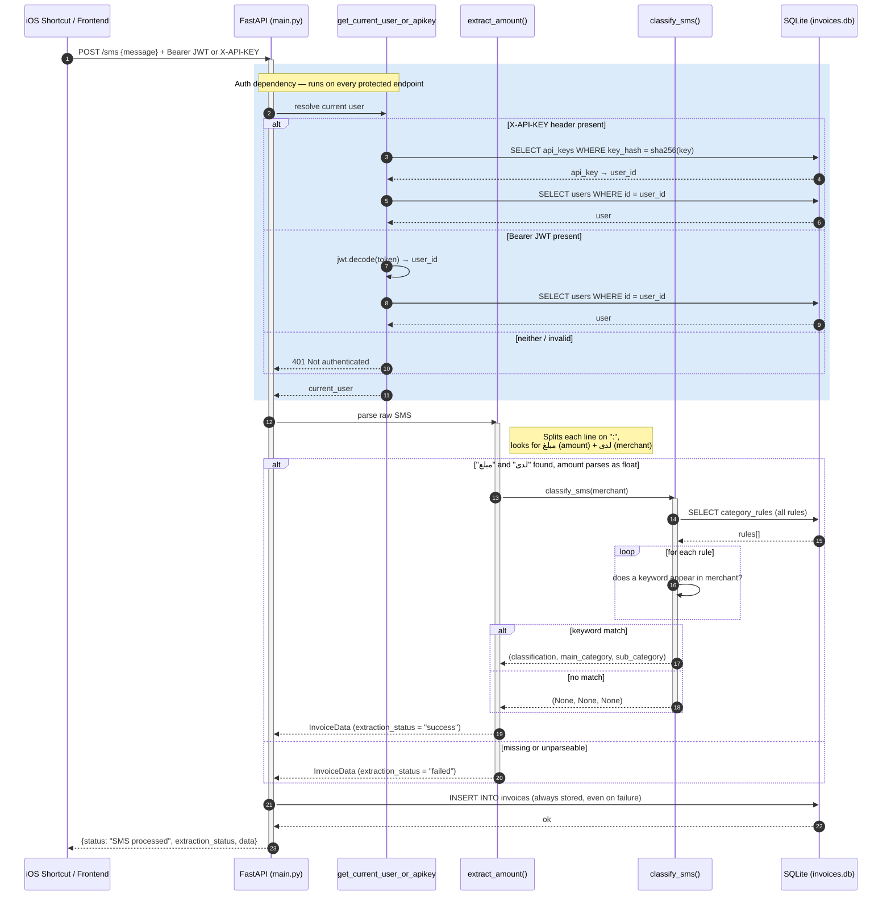
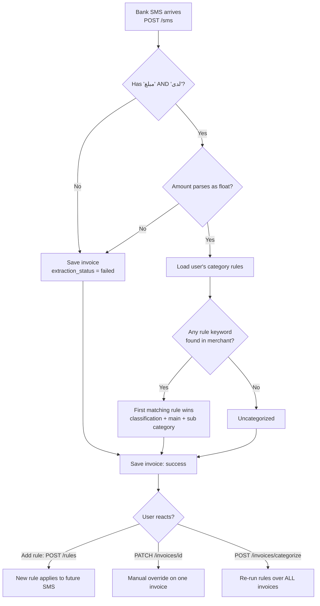
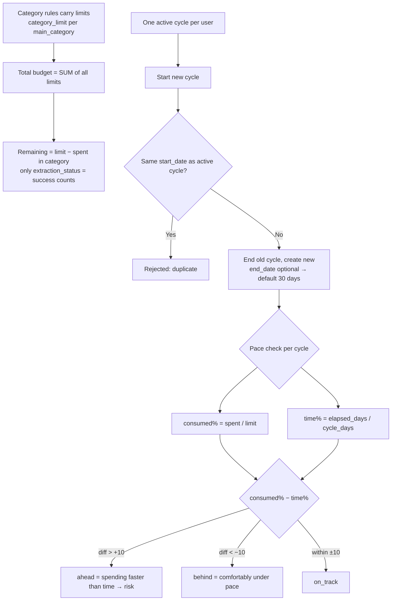

# Budget Office
currently the architecture is a flat monolith mid-refactor toward a modular monolith

A personal finance platform that turns bank SMS notifications into a
categorized, budget-tracked ledger.

Built with **FastAPI + SQLite** (backend) and **Next.js** (frontend).

## What it does

- Ingests Arabic bank SMS (pushed from an iOS Shortcut or typed in the web app)
- Extracts the amount (`مبلغ`) and merchant (`لدى`) from each message
- Auto-classifies expenses using your keyword rules (e.g. "Starbucks" → Food → Coffee)
- Tracks per-category spending limits and rolling budget cycles
- Tells you your spending pace: **ahead / on track / behind**
- Failed extractions are still saved, so you can add a rule and re-categorize later

## Quick start

### Backend

```bash
pip install fastapi uvicorn sqlalchemy pydantic
uvicorn main:app --reload
```

- API: `http://127.0.0.1:8000` — Swagger docs at `/docs`

### Frontend

```bash
cd frontend/my-app
npm install
npm run dev
```

- App: `http://localhost:3000`

## How it works

Every SMS is stored — even when parsing fails. A successful parse extracts
the amount and merchant; the merchant is then matched against your keyword
rules (first match wins). Only successful invoices count toward your
category limits. Limits live on the rules themselves, and a budget cycle
(one active at a time, default 30 days) gives you the pace view: if you've
spent more % of your budget than % of the cycle has elapsed (by more than
10 points), you're flagged **ahead**.

### SMS ingestion flow


```mermaid
sequenceDiagram
    autonumber
    participant IOS as iOS Shortcut / Frontend
    participant API as FastAPI (main.py)
    participant Auth as get_current_user_or_apikey
    participant Ext as extract_amount()
    participant Cls as classify_sms()
    participant DB as SQLite (invoices.db)

    IOS->>API: POST /sms {message} + Bearer JWT or X-API-KEY
    activate API

    rect rgb(220, 235, 250)
    note over API,Auth: Auth dependency — runs on every protected endpoint
    API->>Auth: resolve current user
    alt X-API-KEY header present
        Auth->>DB: SELECT api_keys WHERE key_hash = sha256(key)
        DB-->>Auth: api_key → user_id
        Auth->>DB: SELECT users WHERE id = user_id
        DB-->>Auth: user
    else Bearer JWT present
        Auth->>Auth: jwt.decode(token) → user_id
        Auth->>DB: SELECT users WHERE id = user_id
        DB-->>Auth: user
    else neither / invalid
        Auth-->>API: 401 Not authenticated
    end
    Auth-->>API: current_user
    end

    API->>Ext: parse raw SMS
    activate Ext
    note right of Ext: Splits each line on ":",<br/>looks for مبلغ (amount) + لدى (merchant)
    alt "مبلغ" and "لدى" found, amount parses as float
        Ext->>Cls: classify_sms(merchant)
        activate Cls
        Cls->>DB: SELECT category_rules (all rules)
        DB-->>Cls: rules[]
        loop for each rule
            Cls->>Cls: does a keyword appear in merchant?
        end
        alt keyword match
            Cls-->>Ext: (classification, main_category, sub_category)
        else no match
            Cls-->>Ext: (None, None, None)
        end
        deactivate Cls
        Ext-->>API: InvoiceData (extraction_status = "success")
    else missing or unparseable
        Ext-->>API: InvoiceData (extraction_status = "failed")
    end
    deactivate Ext

    API->>DB: INSERT INTO invoices (always stored, even on failure)
    DB-->>API: ok
    API-->>IOS: {status: "SMS processed", extraction_status, data}
    deactivate API
```

### Business logic: ingestion + learning loop


```mermaid
flowchart TD
    A[Bank SMS arrives<br/>POST /sms] --> B{Has 'مبلغ' AND 'لدى'?}
    B -- No --> F[Save invoice<br/>extraction_status = failed]
    B -- Yes --> C{Amount parses as float?}
    C -- No --> F
    C -- Yes --> D[Load user's category rules]
    D --> E{Any rule keyword<br/>found in merchant?}
    E -- Yes --> G[First matching rule wins<br/>classification + main + sub category]
    E -- No --> H[Uncategorized]
    G --> I[Save invoice: success]
    H --> I
    F --> I
    I --> J{User reacts?}
    J -- "Add rule: POST /rules" --> K[New rule applies to future SMS]
    J -- "PATCH /invoices/id" --> L[Manual override on one invoice]
    J -- "POST /invoices/categorize" --> M[Re-run rules over ALL invoices]
```

### Budget & cycle logic


```mermaid
flowchart TD
    R[Category rules carry limits<br/>category_limit per main_category] --> T[Total budget = SUM of all limits]
    T --> L[Remaining = limit − spent in category<br/>only extraction_status = success counts]
    C[One active cycle per user] --> S[Start new cycle]
    S --> D{Same start_date as active cycle?}
    D -- Yes --> E[Rejected: duplicate]
    D -- No --> N[End old cycle, create new<br/>end_date optional → default 30 days]
    N --> P{Pace check per cycle}
    P --> P1[consumed% = spent / limit]
    P --> P2[time% = elapsed_days / cycle_days]
    P1 --> B{consumed% − time%}
    P2 --> B
    B -- "diff > +10" --> A1[ahead = spending faster than time → risk]
    B -- "diff < −10" --> A2[behind = comfortably under pace]
    B -- "within ±10" --> A3[on_track]
```

### The rules in short

1. **Nothing is ever dropped.** Failed extractions are stored with the raw SMS — they become the learning signal.
2. **Only successful extractions count as spending.** Every aggregate filters on `extraction_status == "success"`.
3. **Classification is order-dependent, first-match-wins**, with substring keyword matching. No match → uncategorized (a first-class bucket in the analysis).
4. **The learning loop is manual-triggered:** new rules apply to future SMS automatically; existing invoices need `POST /invoices/categorize` or a manual patch.
5. **Limits live on the rules** — total budget is `SUM(category_limit)` across your rules.
6. **One active cycle per user**; starting a new one ends the old one (same-start-date is rejected), default 30 days.
7. **Pace is a ±10pp tolerance band** between budget consumed % and time elapsed %.
8. **Multi-tenant by construction:** every query is filtered by `user_id`; the API key path exists so the iOS Shortcut can push without a browser session.

## Key endpoints

| Method | Path | Purpose |
|--------|------|---------|
| `POST` | `/sms` | Ingest a bank SMS |
| `GET` | `/invoices` | List invoices (filter: search, category, min/max amount) |
| `PATCH` | `/invoices/{id}` | Manually re-categorize an invoice |
| `POST` | `/invoices/categorize` | Re-run rules over all invoices |
| `POST/GET/PATCH/DELETE` | `/rules` | Manage keyword classification rules |
| `GET` | `/categories/{cat}/remaining-limit` | Limit vs. spent for a category |
| `POST` | `/cycles/start` · `/cycles/end` | Manage the active budget cycle |
| `GET` | `/cycles/{id}/analysis` | Cycle totals, category breakdown, pace, top merchants |
| `GET` | `/cycles/{id}/spending-timeline` | Daily spend (zero-filled) |
| `POST` | `/auth/login` · `/auth/register` | Web login (JWT) |
| `POST/DELETE` | `/api-keys` | Create / revoke the API key for the iOS Shortcut |

## Project layout

```
main.py           # All API routes + SMS extraction/classification logic
models.py         # SQLAlchemy models (User, APIKey, Invoice, CategoryRule, BudgetCycle)
schema.py         # Pydantic request/response schemas
user_session.py   # Auth: register, login, JWT
app/deps.py       # Auth dependency: API key first, JWT fallback
seed_db.py        # Initial data
```

## License

MIT
